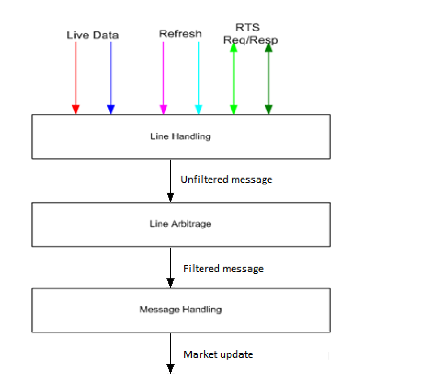

# Internal OMDC market data implementation

## Design

### High level flow diagram

### Packet flow

### Line Handler

Open questions:
- Give thread to each line handler?
    - Use asyncio/event based library
- What is a storage? poll or push
- How to do fill packet drops?
    - Retransmission service.
        - Suitable for small packet drops.
        - Limitation include finite request count
        - TCP
        - How about huge packet drop?

### Refresh service (RFS)
Processing a Refresh
Processing the refresh while coping with the live feed may be a challenging piece of functionality in the
feed handler. There are several things to think about in order to process the refresh properly. The 4
main areas where problems may perhaps arise are:
1. Connectivity
2. Synchronisation
3. Determine a full refresh snapshot
4. Sequencing of events

### Threading

### Tradeoffs

### Questions

### Todo
- [] Write logic for refresh line
- [] Write logic for orderbook update

## Notes

In my opinion, line arbitrage class should be generic and only do line arbitration, there should be no retransmission logic.

But then how to detect packet drop?

I think all this comes to message handler class.
Which will do
- retransmission service logic.
- keep the latest snapshot.
